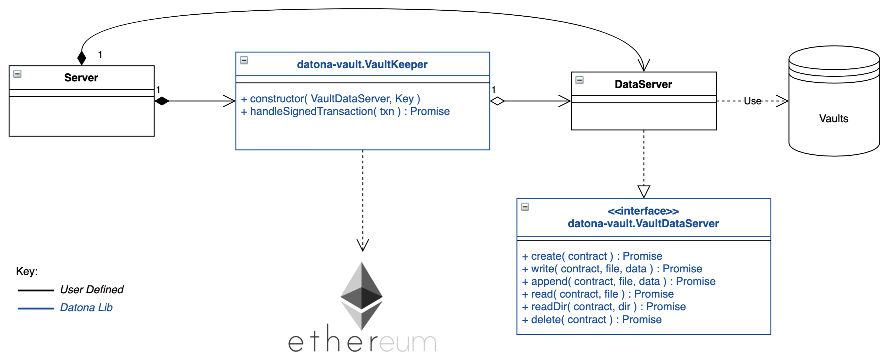

.. _HowToUse:

###################
How To Use
###################

This section describes the use of `datona-lib <https://github.com/Datona-Labs/datona-lib>`_ by the three primary types of developers: Requesters, Owner App Developers and Data Vault Service Providers.

See the :ref:`Smart Data Access Life-Cycle <Lifecycle>` for the overall process.

.. contents::
   :depth: 2
   :local:

**********
Requesters
**********

.. _BuildSDAC:

Building a Smart Data Access Contract
=====================================

All S-DACs must comply with the :ref:`Smart Data Access Contract Interface <SdacInterface>` but the implementation will depend on the use case.  S-DACs can be simple, for example to give indefinite access until terminated; or they can be highly complex giving access to different Requesters depending on a complex workflow supported by external blockchain oracles.

Here is an example of a simple contract that automatically terminates after a given number of days.  It permits access for a single Requester and permits the Owner or Requester to terminate at any time.

.. code-block:: solidity

  pragma solidity ^0.5.1;

  contract Duration_SDAC is SDAC {

      address public owner = msg.sender;
      address public permittedRequester;
      uint public contractDuration;
      uint public contractStart;
      bool terminated = false;

      modifier onlyOwnerOrRequester {
          require( msg.sender == owner || msg.sender == permittedRequester );
          _;
      }

      constructor( address _permittedRequester, uint _contractDuration ) public {
          permittedRequester = _permittedRequester;
          contractDuration = _contractDuration;
          contractStart = block.timestamp;
      }

      function isPermitted( address requester ) public view returns (bool) {
          return ( requester == permittedRequester ) &&
                 ( ! hasExpired() );
      }

      function hasExpired() public view returns (bool) {
          return terminated ||
                 (block.timestamp - contractStart) >= (contractDuration * 1 days);
      }

      function terminate() public onlyOwnerOrRequester {
          terminated = true;
      }

      function getOwner() public view returns (address) {
          return owner;
      }

  }

Building a Smart Data Access Request
====================================

Here is an example :ref:`Smart Data Access Request Packet<SmartDataAccessRequestPacket>` for passing to a data owner.  The *hash* in this request is a hash of the runtime bytecode of the Duration_SDAC above.  The *url* in this request is the URL of the Requester's server that will handle a :ref:`Smart Data Access Response Packet<SmartDataAccessResponse>` from the Owner.

In this case the Requester has added a *customerId* field to the accept and reject transaction templates.  This number will be added to the response that the Owner returns to the Requester.

.. code-block:: json

  {
    "txnType": "SmartDataAccessRequest",
    "version": "0.0.1",
    "contract": {
      "hash": "5573012304cc4d87a7a07253c728e08250db6821a3dfdbbbcac9a24f8cd89ad4",
    },
    "api": {
      "url": {
        "scheme": "file",
        "host": "my.server.io",
        "port": "8601"
      },
      "acceptTransaction": {
        "customerId": "10001"
      },
      "rejectTransaction": {
        "customerId": "10001"
      }
    }
  }

Creating a Server to Handle a Smart Data Access Response
========================================================

If the Owner accepts the Smart Data Access Request then they will inform the Requester of the S-DAC's blockchain address and where the data is being held.  To do this the Requester must run a server to handle the :ref:`Smart Data Access Response Packet<SmartDataAccessResponse>`.

Example of a basic server.  When handling a response the server must perform some validation on the deployed contract.  As a minimum it must check that the deployed contract is of the expected type by checking its runtime bytecode.  In this example it also checks that the signatory of the response is the owner of the contract.

.. code-block:: javascript

  const datona = require('datona-lib');

  //
  // Constants
  //

  const myKey = new datona.crypto.key("e68e40257cfee330038c49637fcffff82fae04b9c563f4ea071c20f2eb55063c");
  const sdacHash = "5573012304cc4d87a7a07253c728e08250db6821a3dfdbbbcac9a24f8cd89ad4";
  const sdacSourceCode = require("./contracts/" + sdacHash);

  //
  // Server
  //

  var customers = [];

  const myServer = net.createServer(connection);
  myServer.listen(8601);

  connection(c){

    c.on('data', (buffer) => {
      try {
        // Decode the transaction and validate the structure of the response packet.  These will throw if not valid
        const txn = datona.comms.decodeTransaction(buffer.toString());
        validateResponse(txn.data, "SmartDataAccessResponse");

        // Ignore if a rejection else validate the contract
        if (txn.data.responseType != "success") {
          sendResponse(datona.comms.createSuccessResponse());
        }
        else {
          // Connect to the Owner's S-DAC on the blockchain
          const contract = new datona.blockchain.Contract(sdacSourceCode.abi, txn.data.contract);

          // Verify the signatory is the owner of the contract and that the correct contract has been deployed,
          contract.assertOwner(txn.signatory)
            .then( () => { contract.assertBytecode(sdacSourceCode.runtimeBytecode) })
            .then( () => {
              // Contract is valid so record the new customer and return a success response
              customers.push(txn.data);
              sendResponse(datona.comms.createSuccessResponse());
            })
            .catch( (error) => {
              sendResponse(datona.comms.createErrorResponse(error));
            });
        }
      }
      catch (error) {
        sendResponse(datona.comms.createErrorResponse(error));
      }
    });

  }

  function sendResponse(c, response) {
    c.write(encodeTransaction(response, myKey));
    c.end();
  }

Monitoring For New Contracts
============================

An alternative to using a server to receive Smart Data Access Responses is to monitor the blockchain directly for new vaults that you are permitted to access.  This method will only work if you know the address and url of the vault server used by all customers, or if you require customers to identify the vault service in the contract itself.  The datona-blockchain :ref:`subscribe` function supports the registering of a callback to be called whenever a new contract of a given type (with a given runtime bytecode) is deployed on the blockchain and you are permitted to access the data it controls.

Example:

.. code-block:: javascript

  const myContract = require("../contracts/myContract.json");
  const subscription = subscribe(datona.crypto.hash(myContract.runtimeBytecode), registerNewCustomer, myKey.address);

  function registerNewCustomer(contractAddress) {
    const newCustomer = { contract: contractAddress };
    customers.push(newCustomer);
  }

.. _RequesterAccess:

Accessing a Customer's Data
===========================

To access a data from a customer's vault you will need the contract address, vault URL and vault server's public address from the SmartDataAccessResponse received from the data owner.  The datona-vault :ref:`RemoteVault<RemoteVault>` class is used to access the vault.

.. code-block:: javascript

  const customer = customers[0];
  const remoteVault = new RemoteVault(customer.vaultUrl, customer.contract, myKey, customer.vaultAddress);

  remoteVault.access()
    .then( (data) => { console.log("vault contains: "+data) )
    .catch( console.error );

********************
Owner App Developers
********************

Receiving a Smart Data Access Request
=====================================

A Smart Data Access Request is passed from Requester to Owner as a :ref:`Signed Transaction<SignedTransaction>`.  Once received, the :ref:`SmartDataAccessRequest<SmartDataAccessRequest>` class is used to decode and validate it.  The app can then display the request to the Owner for acceptance or rejection.

.. code-block:: javascript

  const datona = require('datona-lib');

  const myKey = new datona.crypto.key("b94452c533536500e30f2253c96d123133ca1cbdb987556c2dc229573a2cd53c");

  const request = new datona.comms.SmartDataAccessRequest(signedTxnStr, myKey);

Accepting a Smart Data Access Request
=====================================

The following example demonstrates the use of the :ref:`Contract<Contract>` class to deploy a new S-DAC on the blockchain, and the :ref:`RemoteVault<RemoteVault>` class to create the vault.  It uses the *accept* method of the :ref:`SmartDataAccessRequest<SmartDataAccessRequest>` class to inform the Requester.

.. code-block:: javascript

  const vaultServerAddress = "0x288b32F2653C1d72043d240A7F938a114Ab69584",

  const vaultUrl = {
    scheme: "file",
    host: "datonavault.com",
    port: 8964
  }

  var myDataShares = [];

  //
  // Accept Request
  //

  // Read contract bytecode and ABI from file system and create a Contract object
  const contractSourceCode = require("./contracts/" + request.data.contract.hash);
  const sdac = new datona.blockchain.Contract(contractSourceCode.abi);

  // Function to create a new vault and store the data.  Returns a Promise.
  function createAndDeployVault(){
    const vault = new datona.vault.RemoteVault( vaultUrl, sdac.address, myKey, vaultServerAddress );
    return vault.create("Hello World!");
  }

  // Function to send the contract address and vault URL to the requester.  Returns a Promise.
  function recordContractAndInformRequester(){
    myDataShares.push( {
      contract: sdac.address,
      vault: {
        address: vaultServerAddress,
        url: vaultUrl
      }
    });
    return request.accept(sdac.address, vaultServerAddress, vaultUrl);
  }

  // Deploy the contract, create the vault and inform the requester
  sdac.deploy(myKey, contractSourceCode.bytecode, [request.signatory])
    .then( createAndDeployVault )
    .then( recordContractAndInformRequester )
    .catch( console.error );

Accessing a Vault
=================

To access all data in the vault use the datona-vault :ref:`RemoteVault<RemoteVault>` class, in the same way as a Requester :ref:`accesses a customer's data<RequesterAccess>` above.

.. code-block:: javascript

  const dataShare = myDataShares[0];

  const remoteVault = new RemoteVault(dataShare.vault.url, dataShare.contract, myKey, dataShare.vault.address);

  remoteVault.access()
    .then( (data) => { console.log("vault contains: "+data) )
    .catch( console.error );

Updating a Vault
================

To update the data in the vault use the :ref:`RemoteVault<RemoteVault>` class.

.. code-block:: javascript

  const dataShare = myDataShares[0];

  const remoteVault = new RemoteVault(dataShare.vault.url, dataShare.contract, myKey, dataShare.vault.address);

  remoteVault.update("Hi World!")
    .catch( console.error );

Deleting a Vault
================

To delete the data in the vault simply terminate the contract.  No-one can access the vault once the contract has been terminated, and the data vault server will delete the data when it next checks the contract.  If required the *delete* method of the :ref:`RemoteVault<RemoteVault>` class can be used to force the Data Vault Server to delete the data right away (not shown).

.. code-block:: javascript

  const dataShare = myDataShares[0];

  // Read contract bytecode and ABI from file system and create a Contract object
  const contractSourceCode = require("./contracts/" + dataShare.contract.hash);
  const sdac = new datona.blockchain.Contract(contractSourceCode.abi, dataShare.contract);

  // Terminate contract
  sdac.terminate(myKey)
    .catch( console.error );

***********************
Vault Service Providers
***********************

Creating a Data Vault Server
============================

A Data Vault Server can be a public cloud-based service, a locally hosted server within an organisation or a home-based server.  Whatever the type of server, it must implement the Datona :ref:`Application Layer Protocol <ApplicationLayerProtocol>` and undertake the appropriate permission checks before accepting a create, update, access or delete request.

The Datona Lib :ref:`VaultKeeper<VaultKeeper>` class provides these capabilities leaving the developer to implement the server's data layer.  The VaultKeeper provides the following capabilities:

* decoding and validating incoming :ref:`SignedTransaction` packets and the :ref:`VaultRequest` packet within;
* verifying the appropriate permissions for accepting requests against the S-DAC on the blockchain;
* if permitted, calls a user-defined :ref:`VaultDataServer<VaultDataServer>` instance to handle the request;
* constructing the appropriate success or error :ref:`VaultResponse` packet and encoding it as a :ref:`SignedTransaction`.

The diagram above shows the class relationships between the user-defined classes in black and the datona-lib classes in blue.  The user-defined ``DataServer`` class must implement the VaultDataServer interface and promise to handle the 4 types of data request.  All permission checks will have already been performed by the ``VaultKeeper`` so the ``DataServer`` need only perform the requests unconditionally.

Example bare-minimal server and VaultDataServer implementation.

.. code-block:: javascript

  const datona = require("datona-lib");
  const net = require('net');

  const myKey = new datona.crypto.Key("ae139af24306ecac804cfe974398d6d76361287d7b96d9e165d9bcb99a64b6ce");

  //
  // Example Server.  Has no logging or sigterm detection.
  //

  const vaultManager = new RamBasedVaultDataServer();
  const vaultKeeper = new datona.vault.VaultKeeper(vaultManager, myKey);
  const server = net.createServer(connection);

  function connection(c){

    c.on('data', (buffer) => {
      vaultKeeper.handleSignedRequest(buffer.toString())
        .then( (response) => {
          c.write(response);
          c.end();
        })
        .catch( console.error ); // should never happen
    });

  }

  //
  // Example VaultDataServer.  All vaults are held in RAM!
  //

  class RamBasedVaultDataServer extends datona.vault.VaultDataServer {

    constructor() {
      super();
      this.vaults = {};
    }

    createVault(contract, data) {
      if (this.vaults[contract] != undefined) {
        throw new datona.errors.VaultError("attempt to create a vault that already exists: " + contract);
      }
      this.vaults[contract] = data;
    }

    updateVault(contract, data) {
      if (this.vaults[contract] == undefined) {
        throw new datona.errors.VaultError("attempt to update a vault that does not exist: " + contract);
      }
      this.vaults[contract] = data;
    };

    accessVault(contract) {
      if (this.vaults[contract] == undefined) {
        throw new datona.errors.VaultError("attempt to access a vault that does not exist: " + contract);
      }
      return this.vaults[contract];
    };

    deleteVault(contract) {
      if (this.vaults[contract] == undefined) {
        throw new datona.errors.VaultError("attempt to delete a vault that does not exist: " + contract);
      }
      this.vaults[contract] = undefined;
    };

  }
