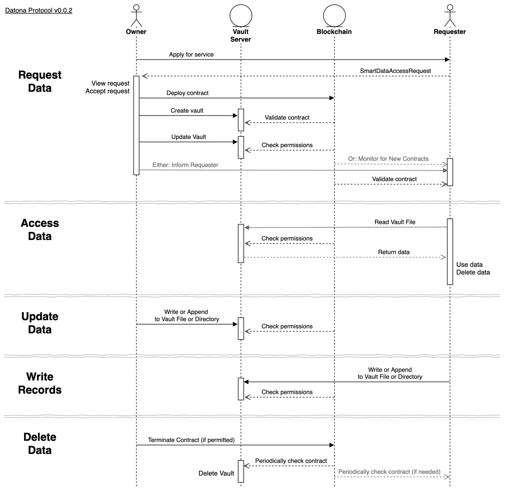

.. _WhatIsSDA:

##########################
What Is Smart Data Access?
##########################

Smart Data Access is a technology that gives individuals control of their online and offline data to combat the rising unethical use and abuse of our data.  When someone shares their data with someone else, Smart Data Access acts like a piece of elastic ensuring the owner of the data always knows who has their data and can update or withdraw it any time, wherever the data is held.

From an organisation's perspective, Smart Data Access helps to automate compliance with data protection regulations and enables new use cases for decentralised applications.  It aims to work closely with existing front-end and back-end infrastructure, rather than reinvent it.

From a regulator's perspective, Smart Data Access is a technological solution to the `GDPR 8 Rights For Individuals <https://ico.org.uk/for-organisations/guide-to-data-protection/guide-to-the-general-data-protection-regulation-gdpr/individual-rights/>`_. In addition it enables new capabilities such as remote auditing and automated auditing of organisations to ensure they are only using data within owners' permissions.

More details can be found in the `Technical White Paper <http://datonalabs.org/documents/WhitePaper.pdf>`_.

.. _HowItWorks:

*****************
How Does It Work?
*****************

Data is protected by Smart Data Access software and controlled by a Smart Data Access Contract (S-DAC). The S-DAC is the piece of elastic that connects the owner with their data.  It specifies the terms and conditions for the management, use, access, update, expiry and deletion of the data.  A Smart Data Access software component, called the Vault Keeper, installed on each data server creates a firewall around the data and ensures it is only accessible if the contract permits it.  If the S-DAC is terminated, the Vault Keeper will automatically delete the data.  Data protected by a Vault Keeper is said to be in a *Vault*.

The S-DAC is deployed on the platform's blockchain - currently Ethereum - so is always accessible from anywhere in the world, whether the data server is available or not.  This allows the data owner to indirectly control the data in the vault at any time.  The Smart Data Access software in the data server includes a full Ethereum node so has an up-to-date view of all S-DACs on the blockchain and can query contracts locally for high performance.

The data itself can be stored anywhere.  Organisations can integrate Smart Data Access into their existing customer databases or can use a third-party 'data vault' cloud service.  Alternatively, owners can host the data themselves.  The data can be accessible from the web or be isolated behind a firewall.  It can even be held completely offline, with some limitations.

Smart Data Access can also be used to control single access data shares where the data is used immediately and then deleted.  Single access shares do not need the blockchain or a data vault service.

Datona labs hosts an experimental cloud server on the Ethereum testnet at datonavault.com for use by all developers.  See :ref:`How To Use<HowToUse>`.

.. _WhatIsAnSdac:

***************************
Smart Data Access Contracts
***************************

An S-DAC must conform to the :ref:`Datona S-DAC Interface Specification <SdacInterface>` but its implementation is entirely user defined.  An S-DAC is a state machine that encodes the life-cycle of the data it controls, specifying who can access the data at what phase and when the owner can update or delete the data.  An S-DAC can be as simple or as complex as needed for the particular use case.  See :ref:`Build a Smart Data Access Contract<BuildSDAC>`.

At this time, the :ref:`Datona S-DAC Interface Specification <SdacInterface>` is a minimal specification and will evolve over time.  In the future a formal standard will be published.

S-DACs will eventually be designed to contain (or reference) a summary of terms for presentation to and acceptance by the user. To ensure that the terms match the life-cycle encoded in the contract, all S-DACs will need to be independently reviewed and validated by an expert community.  It's possible there will eventually be a community library containing off-the-shelf, pre-validated contract templates for general use and an active community of developers creating and validating bespoke contracts for organisations.

.. _Lifecycle:

*****************************************
Life-Cycle of Smart Data
*****************************************

The Smart Data Access process begins with a **Request** for data between the `Requester` and the data `Owner`, known as a *Smart Data Access Request*.  This request identifies the S-DAC to be used to control the contract and how to inform the Requester if the request is accepted.  (In future the request may also contain the summary of terms and a list of trusted vault services).  The request can be presented to the owner in any way.  For example, it could be a QR code on a leaflet; a url behind a button on a web page; or a contactless hardware device on a desk.  In all cases the data owner initiates the process by applying for the service.

Once the Owner accepts a request their app must deploy the contract to the blockchain, store the data in a vault and finally inform the requester of the contract address and vault service used.  The Requester must validate the deployed contract to ensure the correct one has been deployed.

Whenever the requester needs to use the data it can **Access** the vault.  The vault server will check the S-DAC to ensure the Requester is permitted before returning the data.  The requester can then use the data and immediately delete its copy.  The Requester can access the data any time and as many times as the S-DAC allows.

If the Owner's information changes, they can **Update** the data through the vault server's public api.  The vault server will check the S-DAC to ensure the owner is permitted to update the data before updating the vault.

If the S-DAC permits, the Owner can **Delete** the data at any time by terminating the contract.  Once terminated, any attempt by the Requester to access the vault will be denied.  The vault server will periodically check for contract expiry and when found will permanently delete the vault.
